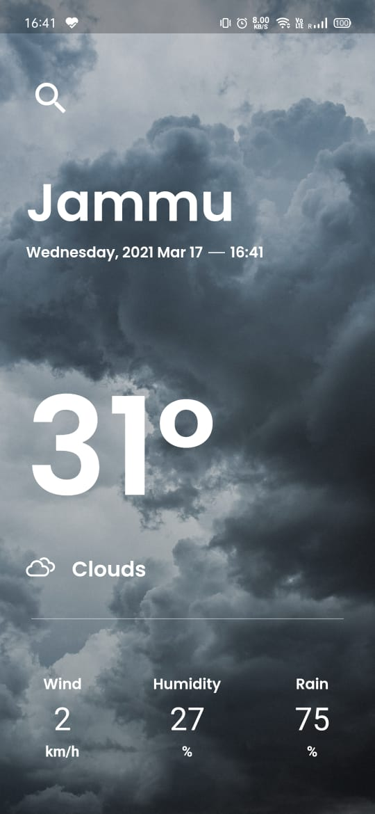

<p align="center">
  <a href="https://github.com/ritz1804/Weather-App">
    
  </a>
</p>
<p align="center">
  Weather uses OpenWeatherMap.org API to get the realtime weather statistics.
</p>
<p align="center">
Show some love 💜 and Star ⭐️ the Repository to support the project.
</p>

## :bookmark_tabs: What’s In This Document

- [Get Up and Running in 5 Minutes](#rocket-get-up-and-running-in-5-minutes)
- [Flutter / Dart Packages Used](#ballot_box-flutter--dart-packages-used)
- [Queries / Bugs](#question-queries--bugs)

## :rocket: Get Up and Running in 5 Minutes

You can get the Weather up and running on your local dev environment in 5 minutes with these four steps:

1. **Install the Flutter SDK & Android Studio. [Instructions](https://medium.com/enappd/install-flutter-on-windows-and-mac-1fd1dde453ba).**

2. **Open Terminal & navigate to the root directory of the project.**

    ```shell
    cd Weather-App
    ```

3. **Run and launch the build on preferred device.**

   ```shell
   flutter run
   ```

4. **Open the source code and start editing!**

   Your app is now running on your physical device or emulator. Open the `lib` directory in Android Studio itself and edit `*.dart` files. Hot Reload your changes, and the app will update in real time!

At this point, you’ve got the fully functional EasyWeather App running. For additional information on how you can customize your Flutter Apps, see [Google Codelabs](https://codelabs.developers.google.com/codelabs/flutter/) and [HackerNoon Guide](https://hackernoon.com/making-the-most-of-flutter-from-basics-to-customization-433171581d01).

## :ballot_box: Flutter / Dart Packages Used
|    Package Name  	| Package Version 	|                           Package URL                          	|    Package Name      	| Package Version 	|                           Package URL                          	|
|:----------------:	|:-------: |:-----------------------------------------------------------: |:-----------------: |:-----:	|:--------------------------------------------------------------:	|
| cupertino_icons  	| 0.1.2    | [Open on pub.dev](https://pub.dev/packages/cupertino_icons)  | flutter_spinkit               | 3.1.0 | [Open on pub.dev](https://pub.dev/packages/flutter_spinkit)              	|
| geolocator      	| 5.3.1    | [Open on pub.dev](https://pub.dev/packages/geolocator)       | weather_icons              | 2.0.1  | [Open on pub.dev](https://pub.dev/packages/weather_icons)  |
| http             	| 0.12.0+4 | [Open on pub.dev](https://pub.dev/packages/http)             |       |   |         |

## :question: Queries / Bugs
If you got any queries or found a bug, open an [Issue](https://github.com/ritz1804/Weather-App/issues/new) 

## :purple_heart: Thanks
